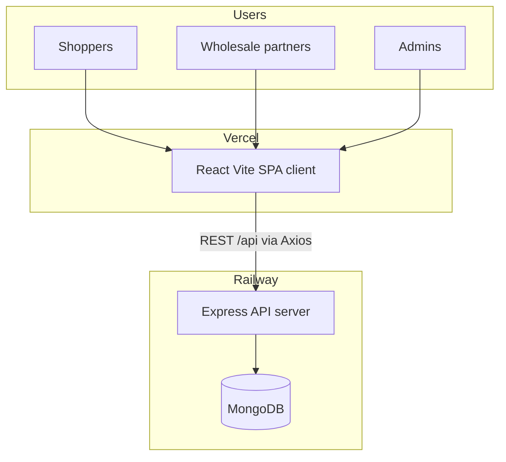
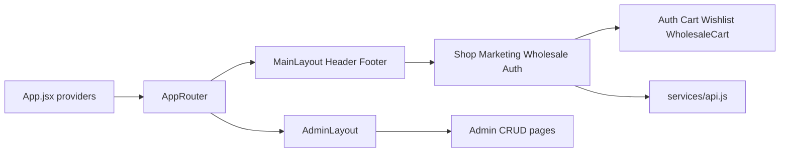
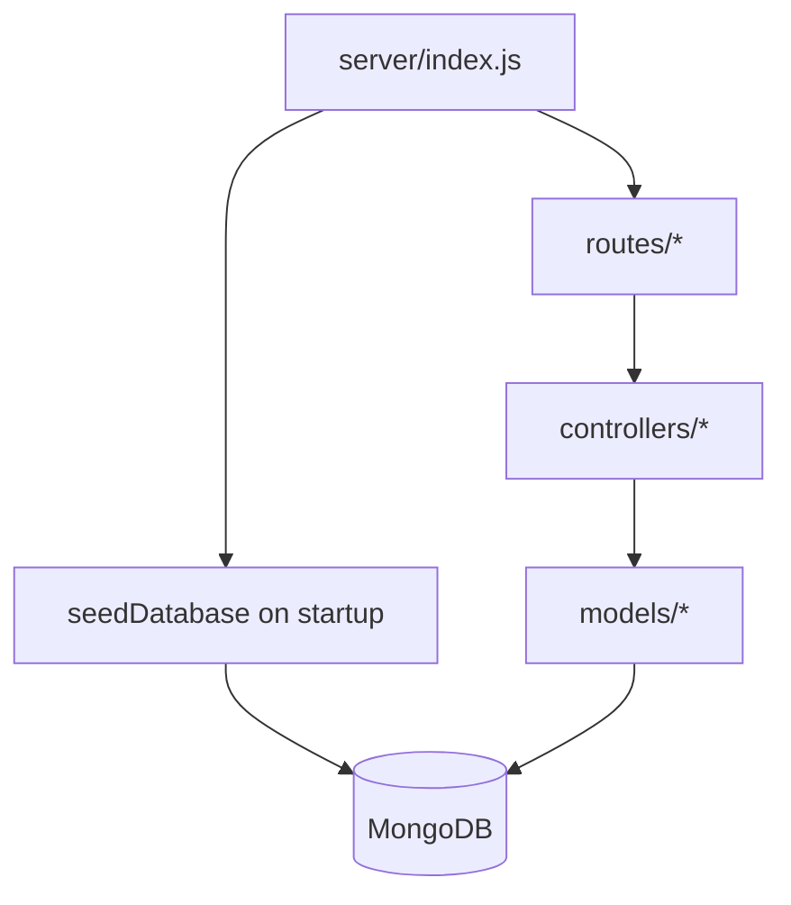
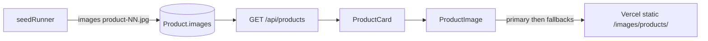

# Modern Gold Jewelry — Project & Architecture

## What this project is

A **full-stack jewelry manufacturing + e-commerce platform** for **Modern Gold Jewelry Manufacturing FE LLC** (Namangan, Uzbekistan).

It is **not** a static brochure site only. It keeps three product surfaces:

1. **B2C storefront** — browse, cart, wishlist, checkout, search, blog, marketing pages
2. **B2B wholesale** — partner registration, wholesale shop, bulk pricing, partner dashboard
3. **Admin** — products, orders, wholesale approvals, customers, blog, settings

**Live:** https://mg-jewelry.vercel.app  
**API:** https://mg-jewelry-api-production.up.railway.app/api

---

## High-level architecture



| Layer | Tech | Folder | Hosting |
|-------|------|--------|---------|
| Frontend | React 19, Vite 8, Tailwind v4, React Router 7 | `client/` | Vercel |
| Backend | Express 5, Mongoose 9, JWT, bcrypt | `server/` | Railway (`mg-jewelry-api`) |
| Database | MongoDB | Railway MongoDB service | Linked via `MONGODB_URI` |
| Monorepo root | Concurrent `dev`, seed, start scripts | `package.json` | Railway starts `server` via root `start` |

Client talks to API through `client/src/services/api.js` (`VITE_API_URL` or `/api` rewrite in `client/vercel.json`).

---

## Frontend architecture



**Entry & providers** (`client/src/App.jsx`):

- `AuthContext`, `CartContext`, `WishlistContext`, `WholesaleCartContext`
- React Router + Helmet (SEO) + toast

**Routing** (`client/src/routes/AppRouter.jsx`):

| Area | Examples |
|------|----------|
| Marketing | `/`, `/about`, `/manufacturing`, `/custom-jewelry`, `/contact` |
| Shop | `/shop`, `/shop/:slug`, `/product/:id`, `/search`, `/cart`, `/checkout`, `/wishlist` |
| Auth/profile | `/login`, `/signup`, `/profile` |
| Wholesale | `/wholesale`, `/wholesale/register`, `/wholesale/shop`, `/wholesale/dashboard` |
| Admin | `/admin/*` (dashboard, products, orders, wholesale, customers, blog, settings) |

**Brand & UI config** (single source of truth):

- `client/src/utils/brandConfig.js` — name, legal name, address, nav, trust copy
- `client/src/utils/imageConfig.js` + `client/src/components/ProductImage.jsx` — local product photos under `public/images/products/`, per-SKU uniqueness, fallbacks
- Homepage built from section components in `client/src/components/sections/`

---

## Backend architecture



**HTTP surface** (mounted in `server/index.js`):

| Prefix | Responsibility |
|--------|----------------|
| `/api/auth` | Register, login, JWT |
| `/api/products` | Catalog, filters, featured |
| `/api/categories` | Category tree |
| `/api/cart`, `/api/wishlist`, `/api/orders` | B2C commerce |
| `/api/wholesale` | B2B registration, wholesale catalog/orders |
| `/api/admin` | Admin CRUD |
| `/api/search` | Product search |
| `/api` (content) | Blog, contact, etc. |
| `/api/health` | Health check |

**Core models** (`server/models/`): `User`, `Product`, `Category`, `Order`, `WholesaleOrder`, `Blog`, `Contact`, `Settings`, plus cart/wishlist and related documents.

**Seed / migrations** (`server/services/seedDatabase.js`):

- Empty DB → full seed via `seedRunner.js` (32 products, `MGJ-` SKUs, 11 categories)
- Legacy `AG-` catalog → reseed
- Broken remote images → patch to local `/images/products/...`
- Duplicate shared images → reassign unique per-SKU paths (`server/config/productImages.js`)

**Auth:** JWT (`jsonwebtoken`) + password hashing (`bcryptjs`); admin defaults from env (`ADMIN_EMAIL` / `ADMIN_PASSWORD`).

---

## Data & image flow



Product image URLs are **paths served by the frontend** (e.g. `/images/products/product-17.jpg`), stored in MongoDB, not hosted on Railway. Unique JPGs live in `client/public/images/products/`.

---

## Deployment topology

| Concern | Choice |
|---------|--------|
| Frontend CDN/host | Vercel project, root = `client` |
| API + DB | Railway project **MG Jewelry**: service `mg-jewelry-api` + MongoDB |
| CORS | `CLIENT_URL` / `CORS_ORIGINS` + allow `*.vercel.app` |
| Local | Root `npm run dev` → Vite `:5173` + API `:4000`; optional in-memory Mongo via `USE_MEMORY_DB=true` |

---

## Repo layout

```
Mg Website/
  package.json          # monorepo scripts
  ARCHITECTURE.md       # this document
  client/               # React SPA
    public/images/      # product photos + fallbacks
    src/pages/          # route pages
    src/components/     # UI + sections
    src/context/        # client state
    src/utils/          # brand + images + price
  server/               # Express API
    routes/ controllers/ models/
    services/           # seed, bulk pricing
    config/             # env, db, productImages
```

---

## Summary

This is a **manufacturer-branded commerce platform**: marketing site + retail shop + wholesale channel + admin, backed by MongoDB, with brand/images centralized on the client and catalog/auth/orders on the Express API. Vercel serves the SPA (and static jewelry images); Railway runs the API and database.
